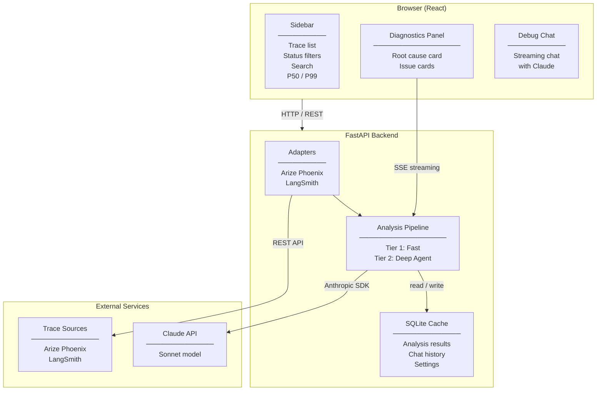
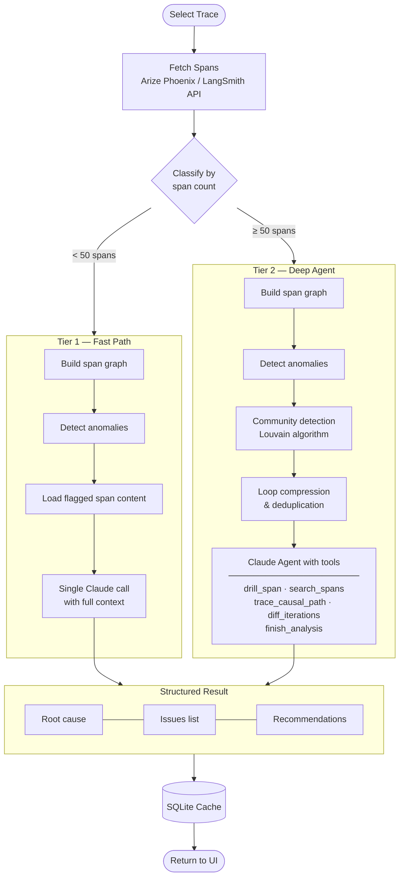

<div align="center">

# TraceIQ

**Stop guessing why your LLM app is broken. Get the answer in seconds.**

TraceIQ connects to your observability platform, analyzes traces with Claude, and delivers a structured root cause diagnosis — issues, causes, and fixes — right in your browser.

[](https://python.org)
[](https://fastapi.tiangolo.com)
[](https://react.dev)
[](https://github.com/Arize-ai/phoenix)
[](https://anthropic.com)
[](LICENSE)

</div>

---


---

## The problem

You've deployed an LLM pipeline. Something is wrong — latency spikes, agent loops, bad outputs, token bloat. You have traces. You have spans. But turning 200 spans into a diagnosis takes hours of manual digging.

**TraceIQ does that in seconds.**

---

## How it works

```
Your traces  →  TraceIQ  →  Root cause + issues + fixes
(Arize Phoenix  (Claude)
 or LangSmith)
```

1. **Connect** — point TraceIQ at your Arize Phoenix or LangSmith project
2. **Select** — pick any trace from the sidebar
3. **Analyze** — Claude investigates the trace using a two-tier engine
4. **Read** — get a structured diagnosis: root cause, categorized issues, recommended fixes

---

## Screenshots

### Diagnostics view


### Connection settings


---

## System architecture



---

## Analysis workflow



---

## Getting started

### Prerequisites

- Python 3.12+
- Node 18+
- [Anthropic API key](https://console.anthropic.com)
- [Arize Phoenix](https://github.com/Arize-ai/phoenix) running locally **or** a [LangSmith](https://smith.langchain.com) account

### Install

```bash
git clone https://github.com/Pratik-Prakash-Sannakki/traceiq.git
cd traceiq

# Backend dependencies
uv sync

# Frontend
cd frontend && npm install && npm run build && cd ..
```

### Configure

```bash
cp .env.example .env
```

```env
# Required
ANTHROPIC_API_KEY=sk-ant-...

# Arize Phoenix (default source)
PHOENIX_URL=http://localhost:6006
PHOENIX_PROJECT=default

# LangSmith (switch in UI settings)
LANGCHAIN_API_KEY=lsv2_pt_...
LANGCHAIN_PROJECT=default
```

### Run

```bash
uv run --env-file .env uvicorn traceiq.api.app:create_app --factory --host 0.0.0.0 --port 8000
```

Open [http://localhost:8000](http://localhost:8000) — that's it.

---

## Connecting a data source

Click the **gear icon** in the top-left → choose **Arize Phoenix** or **LangSmith** → enter your credentials → **Connect**.

TraceIQ tests the connection live and shows you how many traces it found before closing.

| Provider | What you need |
|----------|--------------|
| **Arize Phoenix** | URL (e.g. `http://localhost:6006`) + project name |
| 🦜 **LangSmith** | API key from smith.langchain.com → Settings → API Keys + project name |

---

## Sidebar features

| Feature | How to use |
|---------|-----------|
| **Status filter** | Click Failing / Degraded / Healthy tiles to filter the trace list |
| **Live search** | Type in the search box — filters by trace name or ID instantly |
| **P50 / P99** | Aggregate latency percentiles shown in the trace header |
| **Project name** | Updates instantly when you change data sources — no refresh needed |

---

## Issue categories

| Category | What it catches |
|----------|----------------|
| **Failure** | Error status spans, exception messages, crashes |
| **Latency** | Slow spans, cascading latency, timeout patterns |
| **Logic** | Agent loops, redundant calls, termination failures |
| **Quality** | Token bloat, prompt size issues, context window growth |

---

## Project structure

```
traceiq/
├── src/traceiq/
│   ├── adapters/
│   │   ├── base.py          # TraceAdapter interface
│   │   ├── phoenix.py       # Arize Phoenix connector
│   │   └── langsmith.py     # LangSmith connector
│   ├── analysis/
│   │   ├── engine.py        # Tier 1: single-call analysis
│   │   ├── agent.py         # Tier 2: agentic multi-turn analysis
│   │   ├── community_card.py
│   │   └── loop_dedup.py
│   ├── graph/
│   │   ├── builder.py       # Span graph construction
│   │   ├── anomaly.py       # Anomaly detection rules
│   │   ├── classifier.py    # Tier 1 vs Tier 2 decision
│   │   └── community.py     # Louvain community detection
│   ├── api/
│   │   ├── app.py           # FastAPI app factory
│   │   ├── routes.py        # API endpoints
│   │   └── pipeline.py      # Adapter + engine wiring
│   ├── cache/
│   │   └── db.py            # SQLite cache
│   └── models.py            # Shared dataclasses
├── frontend/
│   └── src/
│       ├── App.tsx
│       ├── components/
│       │   ├── TraceList.tsx
│       │   ├── IssuePanel.tsx
│       │   ├── Chat.tsx
│       │   └── Settings.tsx
│       └── api/client.ts
├── assets/                  # README screenshots
└── .env                     # Local config (gitignored)
```

---

## API reference

| Endpoint | Description |
|----------|-------------|
| `GET /api/traces` | List traces from connected source |
| `GET /api/traces/{id}/analysis` | Get (or run) analysis for a trace |
| `POST /api/traces/{id}/chat` | Stream a chat response (SSE) |
| `GET /api/settings` | Read current connection settings |
| `POST /api/settings` | Save connection settings |
| `POST /api/test-connection` | Validate current adapter credentials |

---

## v0.1 — what's in scope

- Arize Phoenix and LangSmith adapters with correct root span name resolution
- Two-tier Claude analysis (direct for small traces, agentic for large ones)
- Trace filtering by status, live search, P50/P99 stats
- Structured issue cards with category icons, span tags, and recommended fixes
- Debug chat per trace with streaming responses
- Settings modal with live connection test
- Analysis result caching (SQLite)

---

<div align="center">

Built by [Pratik Sannakki](https://github.com/Pratik-Prakash-Sannakki) · Powered by [Claude](https://anthropic.com)

</div>
