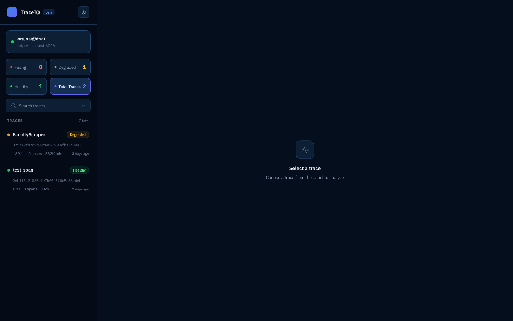
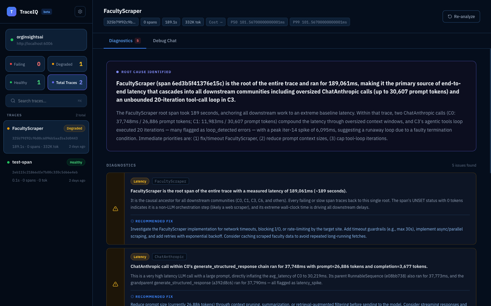
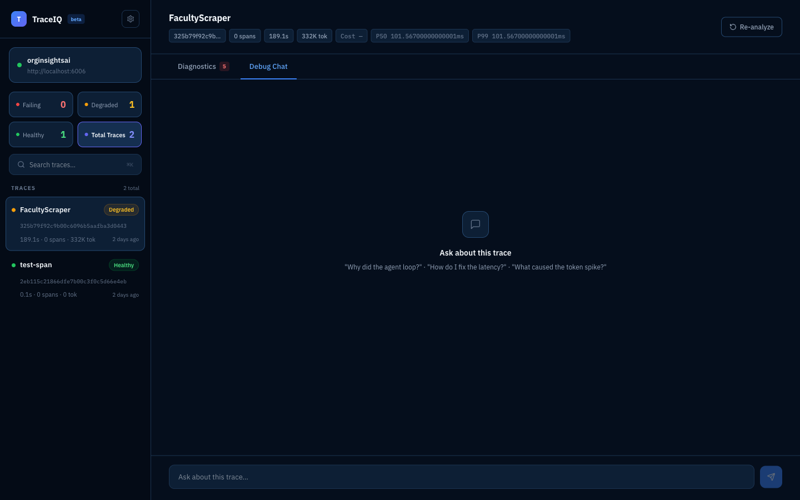
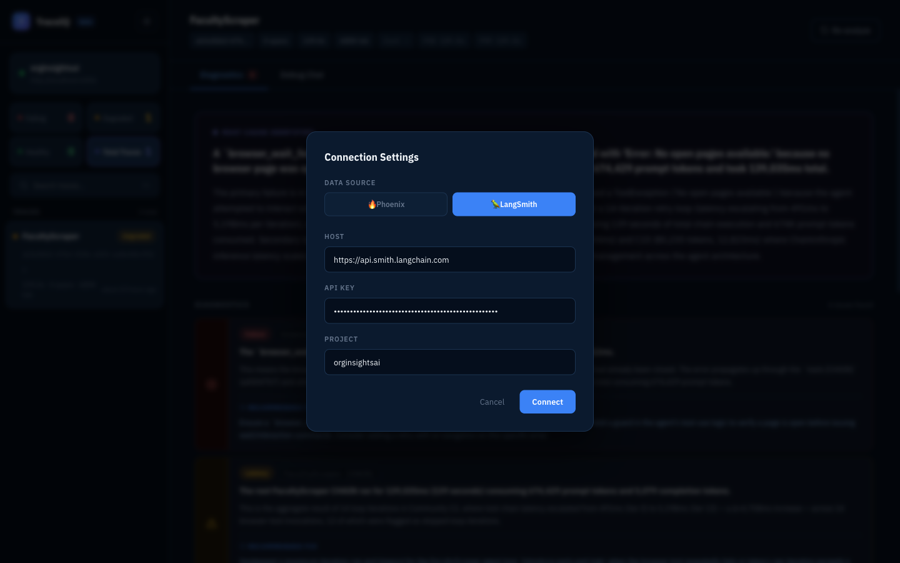
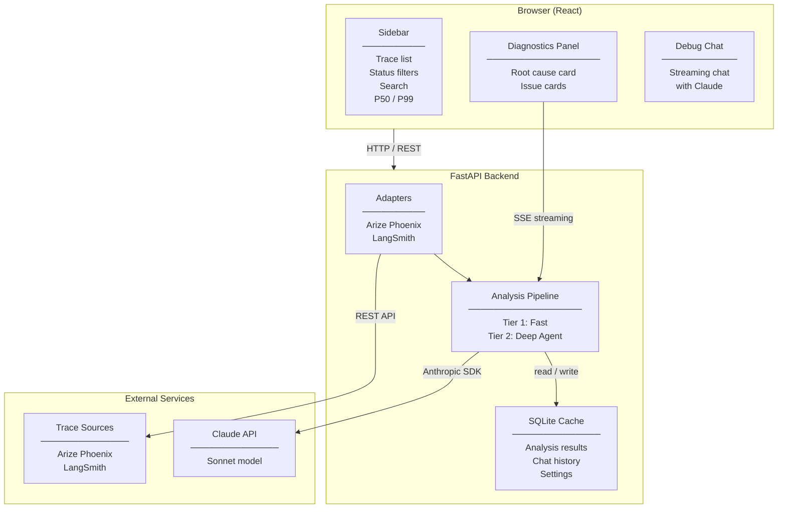

<div align="center">

# TraceIQ

**Stop guessing why your LLM app is broken. Get the answer in seconds.**

TraceIQ is an open-source root cause analysis tool for LLM pipelines. Connect it to your observability platform, select any trace, and get a structured diagnosis — root cause, categorized issues, and concrete fixes — powered by Claude.

[](https://python.org)
[](https://fastapi.tiangolo.com)
[](https://react.dev)
[](https://github.com/Arize-ai/phoenix)
[](https://anthropic.com)
[](LICENSE)

</div>

---



---

## What is TraceIQ?

Debugging LLM pipelines is painful. You have observability — Phoenix, LangSmith — but raw spans don't tell you *why* something is broken. You end up manually correlating hundreds of spans, guessing at root causes, and spending hours on what should take minutes.

TraceIQ closes that gap. It reads your traces, builds a span graph, detects anomalies, and uses Claude to reason across the entire trace — then delivers a plain-English diagnosis in seconds.

### Who is it for?

TraceIQ is not just an engineering tool. Anyone who needs to understand what's happening inside an agentic pipeline — without reading raw spans — can open TraceIQ and get a clear answer.

| Who | How they use it |
|-----|----------------|
| **Engineers** | Pinpoint root causes, get specific fixes, ask follow-up questions about individual spans |
| **Tech managers** | Understand why an AI feature is slow or breaking without needing to read trace data |
| **Founders** | Explain to investors exactly what went wrong last week, with evidence |
| **QA leads** | File precise bug reports backed by a structured diagnosis instead of vague descriptions |
| **Anyone on the team** | Get a plain-English answer about what an agentic pipeline actually did — and why it failed |

---

## Demo

> [Watch the full walkthrough](assets/demo.mp4) — connecting to Arize Phoenix, analyzing a RAG pipeline trace, debug chat, switching to LangSmith.

---

## Features

### Supported Adapters

| Adapter | What it connects to | What you need |
|---------|-------------------|---------------|
| **Arize Phoenix** | Self-hosted Phoenix instance | Phoenix URL (e.g. `http://localhost:6006`) + project name |
| **LangSmith** | LangChain's cloud tracing platform | API key from smith.langchain.com + project name |

Switch between adapters at any time from the settings modal — no restart required.

---

### Diagnostics



When you select a trace, TraceIQ runs it through the analysis engine and surfaces a full diagnosis:

- **Root Cause card** — identifies the single most impactful span or pattern driving the problem and explains how it cascades into downstream issues
- **Issue cards** — one card per detected problem, each with the affected span, an explanation of what went wrong, and a concrete recommended fix
- **Issue count badge** — visible on the tab so you know how many problems exist before reading a word

Every issue is categorized:

| Category | What it catches |
|----------|----------------|
| **Failure** | Error status spans, exception messages, crashes |
| **Latency** | Slow spans, cascading latency, timeout patterns |
| **Logic** | Agent loops, redundant calls, termination failures |
| **Quality** | Token bloat, prompt size issues, context window growth |

---

### Debug Chat



A direct line to Claude with the full trace already loaded — spans, graph, and completed analysis are all in context. Ask anything in plain language:

- *"The 3 retrievers are sequential — if I parallelize them, what latency should I realistically expect?"*
- *"Which single code change cuts the most latency?"*
- *"What's wrong with the should_continue logic in this agent loop?"*

Responses stream in real time. Conversations are persisted per trace so you can return to them later.

---

### Trace Sidebar


- **Status filter tiles** — click Failing / Degraded / Healthy to instantly filter the trace list
- **Live search** — filter traces by name or ID as you type
- **P50 / P99** — aggregate latency percentiles across all loaded traces
- **Project name** — updates instantly when you switch data sources

---

### Connection Settings



- Switch between Arize Phoenix and LangSmith from the settings modal
- TraceIQ tests the connection live and shows trace count before closing
- Settings are persisted — reconnects automatically on restart

---

## How the analysis works

TraceIQ uses a two-tier engine that scales with trace complexity:


**Tier 1 (< 50 spans):** builds the span graph, flags anomalies, loads flagged span content, and makes a single Claude call with full context.

**Tier 2 (≥ 50 spans):** runs Louvain community detection to group the span graph into functional clusters, compresses repeated loop iterations, then hands a Claude agent a set of tools to actively investigate — drilling into spans, tracing causal paths, diffing iterations — before calling `finish_analysis` to submit the result.

Results are cached in SQLite so re-selecting a trace is instant.

---

## System architecture



---

## Getting started

### Prerequisites

- Python 3.12+
- Node 18+
- [Anthropic API key](https://console.anthropic.com)
- [Arize Phoenix](https://github.com/Arize-ai/phoenix) running locally **or** a [LangSmith](https://smith.langchain.com) account

### Install

```bash
git clone https://github.com/Pratik-Prakash-Sannakki/traceiq.git
cd traceiq

# Backend
uv sync

# Frontend
cd frontend && npm install && npm run build && cd ..
```

### Configure

```bash
cp .env.example .env
```

Edit `.env`:

```env
# Required
ANTHROPIC_API_KEY=sk-ant-...

# Arize Phoenix (default adapter)
PHOENIX_URL=http://localhost:6006
PHOENIX_PROJECT=default

# LangSmith (switch to this in the UI settings)
LANGCHAIN_API_KEY=lsv2_pt_...
LANGCHAIN_PROJECT=default
```

You only need to configure the adapter you plan to use. The other can be left blank and set later from the UI.

### Run

```bash
uv run --env-file .env uvicorn traceiq.api.app:create_app --factory --host 0.0.0.0 --port 8000
```

Open [http://localhost:8000](http://localhost:8000). Click the gear icon to connect your first data source.

---

## API reference

| Endpoint | Method | Description |
|----------|--------|-------------|
| `/api/traces` | `GET` | List traces from the connected adapter |
| `/api/traces/{id}/analysis` | `GET` | Get cached analysis or run a new one (`?reanalyze=true` to force) |
| `/api/traces/{id}/chat` | `POST` | Stream a chat response (SSE) |
| `/api/settings` | `GET` | Read current adapter settings |
| `/api/settings` | `POST` | Save adapter settings and switch provider |
| `/api/test-connection` | `POST` | Live-test the current adapter credentials |

---

## Project structure

```
traceiq/
├── src/traceiq/
│   ├── adapters/
│   │   ├── base.py          # TraceAdapter interface
│   │   ├── phoenix.py       # Arize Phoenix connector
│   │   └── langsmith.py     # LangSmith connector
│   ├── analysis/
│   │   ├── engine.py        # Tier 1: single Claude call
│   │   ├── agent.py         # Tier 2: agentic multi-turn analysis
│   │   ├── community_card.py
│   │   └── loop_dedup.py
│   ├── graph/
│   │   ├── builder.py       # Span graph construction
│   │   ├── anomaly.py       # Anomaly detection rules
│   │   ├── classifier.py    # Tier 1 vs Tier 2 decision
│   │   └── community.py     # Louvain community detection
│   ├── api/
│   │   ├── app.py           # FastAPI app factory
│   │   ├── routes.py        # API endpoints
│   │   └── pipeline.py      # Adapter + engine wiring
│   ├── cache/
│   │   └── db.py            # SQLite cache
│   └── models.py            # Shared dataclasses
├── frontend/
│   └── src/
│       ├── App.tsx
│       ├── components/
│       │   ├── TraceList.tsx
│       │   ├── IssuePanel.tsx
│       │   ├── Chat.tsx
│       │   └── Settings.tsx
│       └── api/client.ts
├── assets/
└── .env
```

---

## v0.1 — what's in scope

This is v0.1 — the foundation. More adapters, deeper analysis, and a better UI are all on the roadmap.

- Arize Phoenix and LangSmith adapters with correct root span name resolution
- Two-tier Claude analysis (direct for small traces, agentic for large ones)
- Louvain community detection and loop deduplication for large traces
- Trace filtering by status, live search, P50/P99 latency stats
- Structured issue cards with category icons, span tags, and recommended fixes
- Debug chat per trace with full context and streaming responses
- Settings modal with live connection test and instant adapter switching
- Analysis result caching (SQLite)

---

<div align="center">

Built by [Pratik Sannakki](https://github.com/Pratik-Prakash-Sannakki) · Powered by [Claude](https://anthropic.com)

</div>
